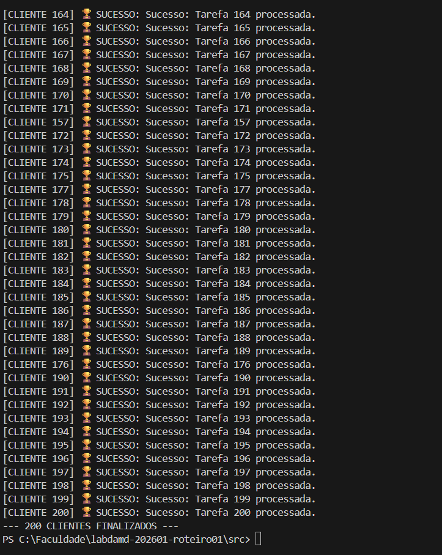

## Resposta questão 1:
O server.py libera o backlog instantaneamente ao delegar o trabalho para threads, mantendo o accept() sempre disponível. No servergargalo.py, o sleep de 5s bloqueia o fluxo principal, causando overflow. Isso força o SO a recusar novas conexões ou ignorar pacotes, causando ConnectionRefused ou Timeout no cliente.
## Resposta questão 2:
No server.py, o  o SO cria uma thread por cliente, gerando um consumo de memória linear para pilhas e alto uso de CPU causado por constante context switching. Já na abordagem assíncrona, o número de threads permanece constante (apenas 1), pois o Event Loop gerencia as conexões como eventos leves em nível de usuário. Enquanto o modelo multithread desperdiça recursos mantendo as threads apenas para esperar o time.sleep(), o modelo assíncrono economiza RAM e processamento, permitindo que um único fluxo de execução suporte milhares de clientes simultâneos sem sobrecarregar o Kernel.
